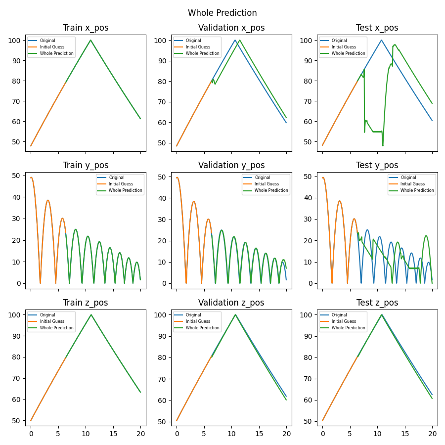

# Ball Bounce Transformer

This tutorial is built on top of the [Ball Bounce VVUQ](../bouncing_ball_vvuq/1_baseline_simulation.md) tutorial by creating a Transformer using the data from the simulation ensembles.

## Overview

A Transformer is a type of Neural Network (NN) that can process data where order is important such as text and time history data. One of the benefits of a Transformer over a Long Short-Term Memory (LSTM) is that transformers can process the tokens (words) in parallel through self-attention for better GPU utilization while LSTMs process the tokens in sequential order. This self-attention also allows each token to gather context from the other words in the sentence to better understand its meaning in relation to the other words in the sentence while the LSTM's sequential processing causes it to predict only on the final sentence vector which is compressed information since each word can't "see" all the other words. More information can be found in ["Attention Is All You Need"](https://arxiv.org/abs/1706.03762). This tutorial will use [Tensorflow](https://www.tensorflow.org/) which is a Machine Learning library developed by Google. [Keras](https://keras.io/) is an API for Tensorflow that allows users to easily and more intuitively work with Tensorflow. This tutorial is based on [Neural machine translation with a Transformer and Keras](https://www.tensorflow.org/text/tutorials/transformer).

## Changes to Ball Bounce VVUQ tutorial

Same changes as the Ball Bounce LSTM tutorial.

## Visualization Transformer Kosh Notebook

This notebook allows the user to train a Transformer model and visualize its predictions. The notebook can be updated as needed to modify the Transformer model and post-process the prediction results. The notebook automatically gets converted to a Python script using the command `jupyter nbconvert --to script $(SPECROOT)/*.ipynb` in the `transformer-ball-bounce` step so there is no need to manually export it to a script. The notebook has more details on what training a Transformer model entails.

Below is the plot of the Transformer prediction and its true value for comparison. This is where fine tuning the model becomes an "art" since adjusting these values could give a completely different prediction. What works for this set of ensembles might not work for another. Note that due to the randomness of the data split and the training early stopping, the predictions below will not be the same each time. Training the model requires a lot of data and time thus the plot below is from a model that was quickly trained with minimal data.

```
num_layers = 4  # The number of encoder and decoder layers
d_model = 128  # The Positional Embedding depth (how many "linguistic" features to create per word)
dff = 512  # How many nodes the feed forward network has per layer
num_heads = 8  # The number of self-attention heads
dropout_rate = 0.1  # Dropout rate in feed forward network

transformer = Transformer(
    num_layers=num_layers,
    d_model=d_model,
    num_heads=num_heads,
    dff=dff,
    input_vocab_size=VOCAB_SIZE+1,
    target_vocab_size=VOCAB_SIZE+1,
    dropout_rate=dropout_rate)
```

